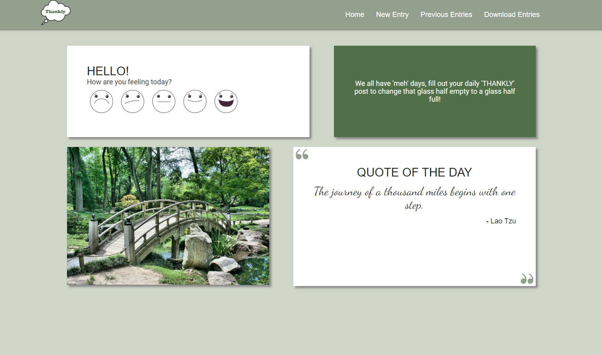

# Project 2: Thankly

## Group Members
* [Josh Chu](https://github.com/JCCCHU)
* [Tobi Bailey](https://github.com/tobi-bailey)
* [Laura Gallant](https://github.com/lauragallant)
* [Massimo Guida](https://github.com/MG-cpu90)

## Description
This application allow users who might be feeling the effects of depression or isolation, or who are feeling down, with an outlet to reflect on the positive things in their lives via a gratitude journal. The "Thankly" journal includes a number of prompts to motivate users to come up with things they are grateful for, which they can post to their journal as a "Thank". Users will be able to review and delete previous posts, or "Thanks". Users can also download their gratitude journal as a branded PDF.

## Features
* Interactive emoticons on the Thankly home page
* Random inspirational quotes on the Thankly home page
* Random prompts to assist users with writing a new Thank
* Ability to add new Thanks to the gratitude journal
* Ability to view all previous entries in the gratitude journal
* Ability to modify entries in the gratitude journal
* Ability to delete entries in the gratitude journal
* Mobile responsive

## Usage
### User Story
```
AS A THANKLY USER who is struggling with isolation during the COVID-19 pandemic…
I WANT to… express myself
SO THAT… I can improve my mental health.

AS A THANKLY USER…
I WANT to… be more positive
SO THAT… I can have a better impact on the world.

AS A THANKLY USER…
I WANT to… become a better communicator
SO THAT… I can have better relationships.

AS A THANKLY USER…
I WANT to… record my moods and mental status
SO THAT… I can track my mental health over periods of time.

AS A THANKLY USER…
I WANT to… define my mood using the mood emoticons,
SO THAT… I receive a motivation pep-talk based on that mood.

AS A THANKLY USER…
I WANT to… see a motivational quote,
SO THAT… I feel inspired to write my daily “thanks”.

AS A THANKLY USER…
I WANT to… receive a gratitude prompt,
SO THAT… I have a clear direction on what to write about.

AS A THANKLY USER…
I WANT to… be able to view and delete old posts,
SO THAT… I can reflect on past entries and delete ones that no longer apply.

AS A THANKLY USER…
I WANT to… download a PDF gratitude worksheet,
SO THAT… I can take my gratitude entries “offline”.

```
- - -

### Acceptance Criteria
```
GIVEN I am a THANKLY user wanting to use the Thankly gratitude journal…
WHEN… I click on the emoticons to indicate my mood on the home page
THEN… I am presented with a motivational quote.

WHEN… I refresh the home page
THEN… I am presented with a new, random inspirational quote.

WHEN… I click on the “NEW ENTRY” tab
THEN… I am brought to a new page which allows me to post a new entry into my journal, and I am given a random prompt.

WHEN… I insert my name and response and click on the “POST” button
THEN… my post is added to database and displayed the “PREVIOUS ENTRIES” page.

WHEN… I click on the “PREVIOUS ENTRIES” tab
THEN… I am shown a list of all of my posts.

WHEN… I click on the “DELETE” button for a specific Thank
THEN… that Thank is deleted from the page and the database.

WHEN… I click on the “EDIT” button for a specific Thank
THEN… I am able to modify a thank and re-post it.

WHEN… I click on the “DOWNLOAD ENTRIES” tab and subsequently on “PDF” icon
THEN… I am brought to a page which allows me to download my journal entries.

WHEN… I click on the “PDF” icon
THEN… I am can download my journal entries as a PDF.
```
- - -

## Application Screenshot



## Accessories Used
### Languages
* HTML
* CSS
* JavaScript
* [jQuery](https://jquery.com/)
* [Materialize CSS Framework](https://materializecss.com/)
* [Font Awesome](https://fontawesome.com/)

### Programs and Applications
* [Visual Studio Code](https://code.visualstudio.com/)
* [Google Chrome](http://www.google.com/chrome)
* [MYSQL](https://www.mysql.com/) (Databases)
* [Node.js](https://nodejs.org/en/)
* Git/Terminal
* [Adobe InDesign](https://www.adobe.com/products/indesign.html)
* [Zoom](http://www.zoom.us/)
* [Slack](https://slack.com/intl/en-ca/)

### Libraries
* [Express](https://expressjs.com/)
* [Sequelize ORM](https://sequelize.org/)
* [Handlebars](https://handlebarsjs.com/)
* [ESLint](https://eslint.org/)
* [Moment.js](https://momentjs.com/)
* Additional libraries/packages/technologies used:
    * [PDFKit](https://pdfkit.org/)

### Websites
* [GitHub](https://github.com/)
* [Heroku](https://www.heroku.com/)
* [Google](https://www.google.com) [fonts](https://fonts.google.com/), drive, google docs, sheets, and slides
* [InVisionApp](https://www.invisionapp.com/) (Wireframes)
* [moqups.com](https://moqups.com/) (Wireframes)
* [W3Schools](https://www.w3schools.com/)
* [Stack Overflow](https://stackoverflow.com/)

### Logos, Emoticons, and Motivational Quotes
* [@slowcountrycomics](https://www.instagram.com/slowcountrycomics/?hl=en)

### Third-party APIs 
* [type.fit](https://type.fit/api/quotes) (Random Inspirational Quotes)

## Links
* Deployed URL: 
* GitHub repository: https://github.com/MG-cpu90/thankly